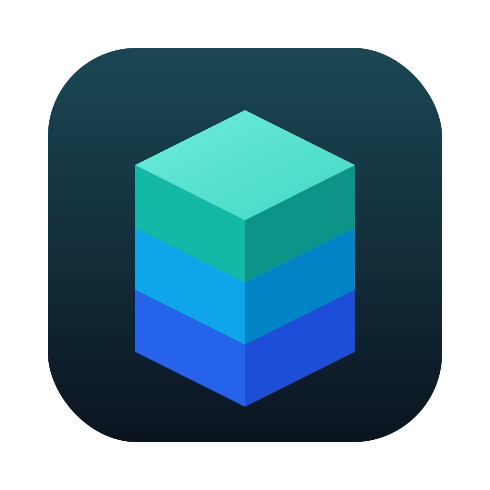
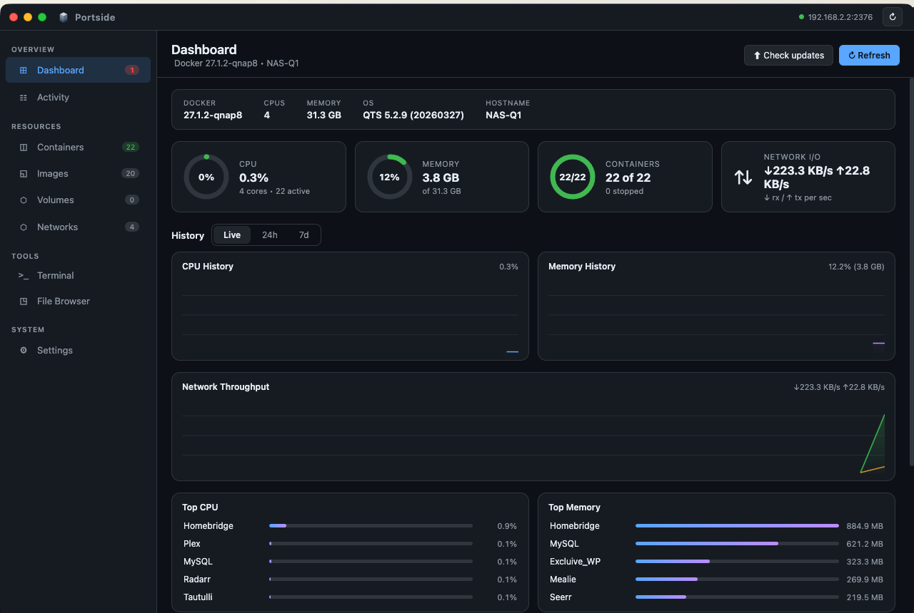
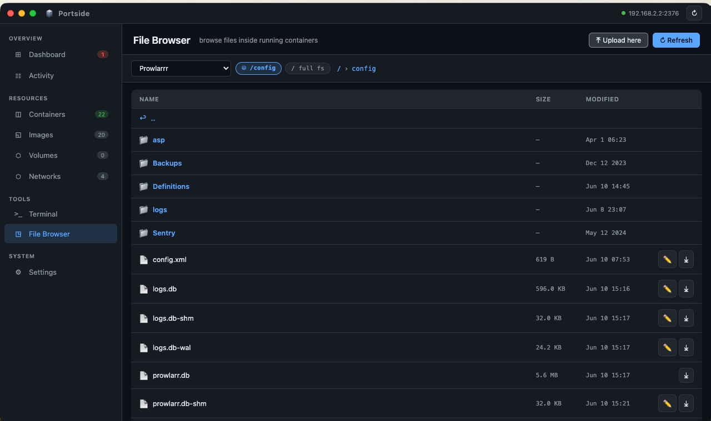
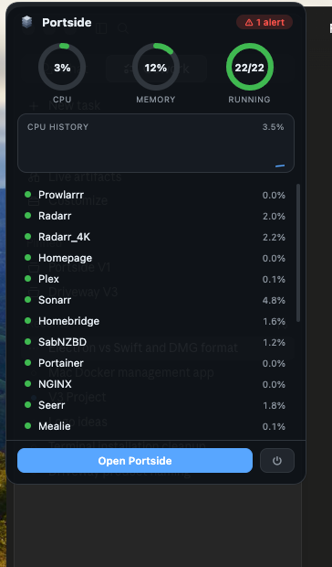

<p align="center">
  
</p>

<h1 align="center">Portside</h1>

<p align="center">
  A native-feeling macOS app for managing Docker on your QNAP NAS<br>
  (or any TLS-enabled Docker host). Built for home labs, by a home labber.
</p>

<p align="center">
  
  
  
  
  
</p>

---

## ⚠️ Full disclosure: I am not a programmer

This entire app was **vibe coded with Claude** (Anthropic's AI). I'm an IT guy with a
QNAP NAS, a pile of *arr containers, and opinions about UI — not a developer. I described
what I wanted, Claude wrote literally every line, tested it against my actual NAS, and we
went back and forth until it felt like a real Mac app.

I wanted Portainer-style container management without opening a browser tab, plus the
stuff Container Station refuses to do nicely. Now it exists, and since it's genuinely
become my daily driver, I figured I'd share it.

**What that means for you:** it works great on my setup (QNAP QTS 5.x, Container Station,
~22 containers, Apple Silicon Mac). Beyond that — read the code, trust nothing, file
issues, and keep your expectations calibrated to "a guy and his AI made this in a day." 😄

## What it does

- 📊 **Dashboard** — host CPU/memory rings, network throughput, live history charts (Live / 24h / 7d, persisted to disk), top-consumer leaderboards
- 💡 **Insights** — an action list, not a metrics feed: crashes with exit codes, restart loops, failing health checks, pending updates, and reclaimable junk. Nothing that appears and vanishes on its own
- 🧱 **Stacks** — compose projects are grouped automatically from their labels, with start/stop/restart for the whole stack
- ☑️ **Bulk actions** — select any set of containers and start/stop/restart/remove them in one go
- 📦 **Export** — rebuild any container anywhere: export its live config as `compose.yml` or a `docker run` command
- 🧹 **Resource pages** — images, volumes and networks show what's *in use* vs *unused* vs *dangling*, with per-object delete (not just all-or-nothing prune)
- 🎚 **Resource limits** — set a memory cap and CPU quota when deploying or editing, so one runaway container can't take the NAS down
- 🔔 **Notification rules** — choose exactly which events interrupt you (crash, unhealthy, restart loop, image update, GitHub release, expiring certs)
- ⬆️ **Image update checker** — compares your containers' image digests against the registry (built-in Watchtower, but you stay in control) with one-click pull & recreate + rollback
- >_ **Terminal** — exec into any running container, full xterm with colors
- 📁 **File Browser** — browse mapped volumes (or the full container fs), download, upload, and **edit config files in-app**
- 🚀 **Deploy wizard** — pull an image and create a container with ports/volumes/env/restart policy, no YAML required
- 📜 **Live logs** — streaming with ANSI colors, pause, and search
- ☷ **Activity feed** — real-time Docker events (starts, stops, crashes, pulls)
- 🖥 **Multi-host** — manage several Docker hosts, each with its own TLS certs
- 📍 **Menu bar companion** — graphical popover with rings, sparkline and per-container actions; the app keeps monitoring (and notifying) with the window closed
- 🌐 **Web UI buttons** — one click opens any container's web interface
- 🎨 Dark / light / system themes, four logo colorways, autostart, startup animation

## Screenshots

| Dashboard | File Browser |
|---|---|
|  |  |

<p align="center">
  
</p>

## Install

1. Grab the latest `.dmg` from [**Releases**](https://github.com/Mac2100/portside/releases)
2. Drag **Portside** to Applications
3. First launch: **right-click → Open** (it's unsigned — I'm not paying Apple $99/year for a hobby project, sorry)
4. Settings → add your host's IP and import your TLS certificates

> Apple Silicon only for now. Intel Mac users can build from source with `npm run build`.

### Getting your QNAP certificates

Container Station → **Preferences → Docker Certificate → Download**. Unzip it — you get
`ca.pem`, `cert.pem` and `key.pem`. Import all three via **Settings → TLS Certificates**
(per-host import supported). Also make sure Container Station's Docker API (port 2376) is enabled.

Any other Docker host with TLS (`dockerd` with `--tlsverify`) works the same way.

## Build from source

```bash
git clone https://github.com/Mac2100/portside.git
cd portside
npm install
npm start          # run it
npm run build      # build the .app / .dmg into dist/
```

## How it works (as explained to me)

Plain Electron — no frameworks, no build step, a main process that talks to the Docker
Engine API directly over TLS. Terminal sessions use the exec API with a hijacked TCP
stream, the file browser rides the archive API with a hand-rolled tar parser, and the
update checker does registry digest comparisons with proper bearer-token auth. The menu
bar panel is a frameless vibrancy window. Your certs and config never leave your machine.

```
main.js          Electron main process — all Docker API calls, TLS, IPC handlers
preload.js       the contextBridge: the only surface the UI can reach
index.html       markup only
css/app.css      all styles
js/NN-*.js       the renderer, loaded in order; plain scripts sharing one scope
test/            npm test — smoke test (no deps) + jsdom boot test
```

`npm test` parses every renderer script, checks that every `$('id')` resolves, then boots
the whole UI in jsdom against a fake Docker host and asserts the pages render. It's what
stands between me and shipping a white window.

## Disclaimers

- Not affiliated with Docker, QNAP, Portainer, or the *arr projects
- The container update feature recreates containers (config and volumes are preserved, old container logs are not)
- An AI wrote this. A human (me) merely yelled directions and clicked "yes". Review the code before trusting it with anything important — it's a few thousand lines and honestly pretty readable

## License

[PolyForm Noncommercial 1.0.0](LICENSE) — free for personal use, home labs, hobby
projects, education, and nonprofits. If you want to use Portside **commercially**
(sell it, bundle it, build a paid product on it), that requires my permission —
open an issue or get in touch.

Translation: enjoy it at home, but if you make a million bucks off it, I'd like to hear about it first. 😄
